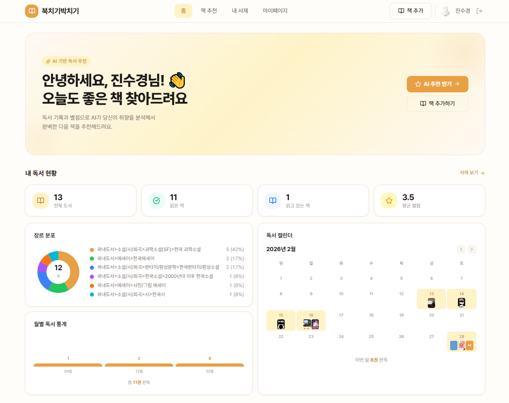

# Bookchiki (북치기박치기)

사용자의 독서 기록과 평점을 기반으로 AI가 책을 추천해주는 개인화 독서 서비스.



2026-03-12 첫번째 배포 [확인하기](https://bookchiki.vercel.app)


<br>

- 📖 **독서 기록 관리** — 읽은 책 등록, 별점, 메모/하이라이트
- 🎯 **AI 책 추천** — 시스템1: 기록 기반 개인화 추천 / 시스템2: 취향 프로필 + 자연어 질문 기반 맞춤 추천
- 📊 **독서 통계** — 월별 독서량, 장르 분포, 평균 평점
- 📥 **데이터 임포트** — 북적북적 등 외부 앱 CSV 가져오기
- 🖼 **북스타그램 이미지 생성** — 책의 분위기에 맞는 AI 배경 생성(DALL-E 3) + 하이라이트 문구 편집 및 카드 이미지 저장


## 기술 스택

| 영역 | 기술 |
|------|------|
| 백엔드 | FastAPI (Python 3.11) |
| 메인 DB | PostgreSQL 16 |
| 검색/벡터 | OpenSearch 2.17 (하이브리드 BM25 + KNN) |
| AI/ML | OpenAI API (GPT-4o-mini, text-embedding-3-small) |
| 도서 데이터 | 알라딘 TTB API (실시간 보완) |
| 배치 스케줄링 | APScheduler (자정 배치) |
| 프론트엔드 | Next.js 15 + Tailwind v4 + TanStack Query v5 |
| 배포 | Docker Compose (개발) / AWS EC2(OpenSearch) + RDS / Vercel (프론트) |
| 인증 | Google OAuth 2.0 + JWT |

## 추천 시스템

### 시스템 1 — 기록 기반 개인화 추천

DB 영속 취향 프로필 (`user_preference_profiles`) + `is_dirty` 이벤트 기반 캐시 + 알라딘 실시간 보완 + CF 앙상블로 즉시 응답.

```
GET /recommendations
        │
   is_dirty 확인 (ISBN 이중 필터)
   ┌─────┴─────┐
false           true
   │               │
캐시 히트        파이프라인 실행
(~10ms)         ├─ 서재 + dismissed 제외 목록 구성
                ├─ 취향 벡터 계산 (평점 가중 임베딩 + 메모 임베딩)
                ├─ OpenSearch books 인덱스 하이브리드 검색 (BM25 + KNN)
                ├─ 알라딘 실시간 보완 (DB 밖 책도 추천 가능)
                │   └─ 신규 책 자동 저장 + 백그라운드 인덱싱
                ├─ CF 앙상블 스코어링 (ALS 모델 있을 때만)
                │   └─ 최종 점수 = α × OpenSearch + (1-α) × CF
                │      (α는 서재 책 수에 따라 동적 조절)
                ├─ 다양성 보장 + score 정규화 (0.8 ~ 1.0)
                ├─ 최종 N권 DB 저장
                ├─ user_preference_profiles 갱신 (is_dirty=false)
                └─ 추천 이유 생성 (GPT-4o-mini)
```

**Dirty 마킹 트리거:** 책 추가 / 평점·메모·상태 변경 / 책 삭제 / CSV 임포트 / (매일 자정 배치)

**Dismiss 기능:** "다른 책" 버튼으로 추천 책 영구 비추천 (`POST /recommendations/dismiss/{book_id}`). ISBN 기반 이중 필터로 이후 모든 추천에서 제외.

**CF 앙상블 규칙:**
- 서재 < 10권 → α=0.9 (콘텐츠 위주)
- 서재 10-29권 → α=0.7 (균형)
- 서재 ≥ 30권 → α=0.5 (CF 비중 증가)
- CF 모델 없으면 graceful degradation (OpenSearch만 사용)

### 시스템 2 — 자연어 질문 기반 맞춤 추천

취향 프로필 + RAG 지식 + **실시간 웹 검색(Tavily)**을 결합하여 질문에 맞는 **검증된 실존 도서**만 추천.

```
POST /recommendations/ask  { "question": "감동적인 가족 이야기 추천해줘" }
        │
user_preference_profiles.profile_data 조회
        │
├─ rag_knowledge 인덱스 하이브리드 검색 (BM25 + KNN)
└─ Tavily Web Search (실시간 웹 검색으로 최신/실존 후보 확보)
        │
취향 프로필 + RAG 데이터 + 웹 검색 후보 → LLM 선별 (10권 후보 생성)
        │
알라딘 API 엄격 검증 (Strict Validation)
        │
실존하는 진짜 책 3권 확정 + AI 추천 사유 반환
```

## 빠른 시작

### 환경 설정

```bash
cd backend && cp .env.example .env
# .env: OPENAI_API_KEY, ALADIN_API_KEY, JWT_SECRET_KEY 필수 입력
```

```bash
# 1. 백엔드 + DB (Docker) — :8000 · :5432 · :9200
docker compose up

# 2. 프론트엔드 (별도 터미널) — :3000
cd frontend && npm install  # 처음 1회
cd frontend && npm run dev

# 3. (처음에만) DB + 인덱스 초기화
cd backend && python reset_db.py

# 4. (선택) CF 모델 학습
docker compose exec -w /project backend python scripts/train_cf.py
```

### 서비스 접속

- **앱:** http://localhost:3000
- **API 문서:** http://localhost:8000/docs
- **Health 체크:** http://localhost:8000/health

**인증 방식:**
- Google OAuth 2.0 기반 로그인
- JWT Access Token (기본 15분 만료) + Refresh Token (기본 7일 만료)
- Refresh Token은 DB 저장 및 로그아웃 시 자동 폐기
- 개발 중에도 실제 Google OAuth 요구 (우회 없음)

**추천 시스템 모드:**
- **CF 모델 없을 때:** OpenSearch 하이브리드 검색만 사용 (graceful degradation)
- **CF 모델 있을 때:** OpenSearch + CF 앙상블로 점수 보정 (서재 데이터량에 따라 가중치 조절)

## 주요 API

| 엔드포인트 | 설명 |
|-----------|------|
| `POST /auth/google` | Google OAuth 로그인 |
| `PATCH /auth/me` | 프로필 업데이트 (인스타그램 계정 등) |
| `DELETE /auth/me` | 회원 탈퇴 (익명화 처리) |
| `GET /books/search/aladin` | 알라딘 도서 실시간 검색 |
| `GET /my-books` | 내 서재 목록 및 독서 통계 |
| `GET /recommendations` | 추천 시스템1: 개인화 추천 (opensearch 하이브리드 서치 기반 CBF +CF)) |
| `POST /recommendations/ask` | 추천 시스템2 (RAG): 질문 기반 맞춤 추천 (Tavily 검색 보완) |
| `POST /recommendations/dismiss/{book_id}` | 추천 도서 영구 제외 |
| `GET /recommendations/profile` | 취향 프로필 조회 |
| `POST /recommendations/refresh` | 강제 추천 재생성 |
| `POST /imports/csv` | CSV 임포트 |
| `POST /admin/seed-books` | 초기 도서 데이터 시딩 (관리자) |
| `POST /admin/index-books` | books → OpenSearch 인덱싱 (관리자) |
| `POST /admin/index-user-books` | 평점/메모 → OpenSearch 인덱싱 (관리자) |

## 프로젝트 구조

```
bookchiki/
├── backend/
│   ├── app/
│   │   ├── api/            # FastAPI 라우터
│   │   ├── models/         # SQLAlchemy ORM
│   │   ├── services/
│   │   │   ├── aladin.py            # 알라딘 API 클라이언트
│   │   │   ├── book_import.py       # CSV 파싱
│   │   │   ├── rag.py               # 임베딩 + 하이브리드 검색
│   │   │   ├── recommend.py         # 추천 파이프라인 (기록 기반 + CF 앙상블)
│   │   │   ├── cf_scorer.py         # CF 점수 조회 서비스 (싱글톤)
│   │   │   ├── profile_cache.py     # 취향 프로필 캐시 관리
│   │   │   ├── book_indexer.py      # books → OpenSearch 인덱서
│   │   │   ├── user_book_indexer.py # 평점/메모 → OpenSearch 인덱서
│   │   │   ├── book_search.py       # OpenSearch 하이브리드 검색
│   │   │   └── data_seeder.py       # 데이터 시딩 파이프라인
│   │   ├── opensearch/     # 인덱스 매핑 관리
│   │   └── core/           # 설정, DB, 인증
│   ├── models/             # CF 모델 저장소 (cf_model.npz, cf_mapping.json)
│   ├── alembic/            # DB 마이그레이션
│   └── Dockerfile
│
├── frontend/               
│   ├── app/                 # Next.js App Router
│   │   ├── page.tsx         # 홈 페이지
│   │   ├── login/           # 로그인 페이지
│   │   ├── library/         # 내 서재 + 책 검색
│   │   ├── recommendations/ # 추천
│   │   ├── create-image/    # 북스타그램 이미지 생성
│   │   └── mypage/          # 마이페이지
│   ├── components/          # UI 컴포넌트
│   ├── hooks/               # React 훅
│   ├── lib/                 # API 클라이언트
│   ├── tailwind.config.ts   # Tailwind v4
│   ├── package.json
│   └── .env.local
│
├── scripts/               # 헬퍼 스크립트 (CF 학습, Data Backup 등)
├── docs/
│   ├── API.md             # API 엔드포인트
│   ├── ENV.md             # 환경변수
│   ├── INDEX.md           # 문서 인덱스
│   └── CONTRIBUTING.md    # 개발 가이드
│
├── docker-compose.yml
├── .env.example
└── README.md              # 이 파일
```


## 환경 변수

| 변수 | 필수 | 설명 |
|------|------|------|
| `DATABASE_URL` | ✅ | `.env.example` 참고 |
| `OPENAI_API_KEY` | ✅ | GPT-4o-mini + 임베딩 |
| `ALADIN_API_KEY` | ✅ | 도서 검색/검증 |
| `JWT_SECRET_KEY` | ✅ | `python -c "import secrets; print(secrets.token_urlsafe(32))"` |
| `GOOGLE_CLIENT_ID/SECRET` | ✅ | OAuth (프로덕션만 필수) |
| `OPENSEARCH_HOST` |  | 기본값 `opensearch` (Docker) |
| `FRONTEND_URL` |  | CORS 허용 URL |

## 주의사항

- **DB/인덱스 리셋** — 모든 데이터 삭제. 반드시 확인 후 진행
- **API 키** — `.env` 파일을 절대 커밋하지 말 것
